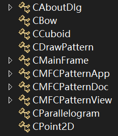
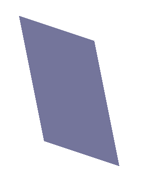
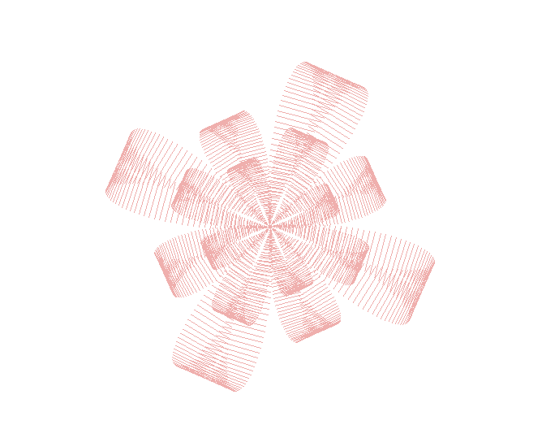
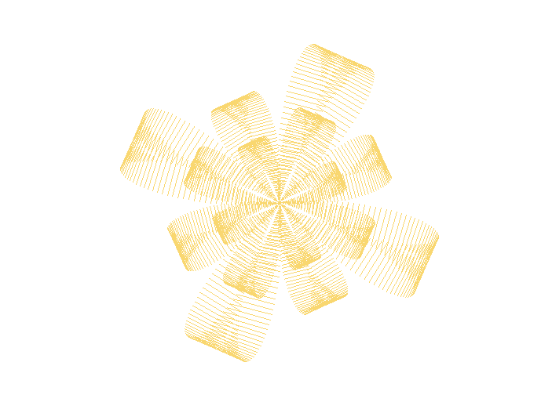
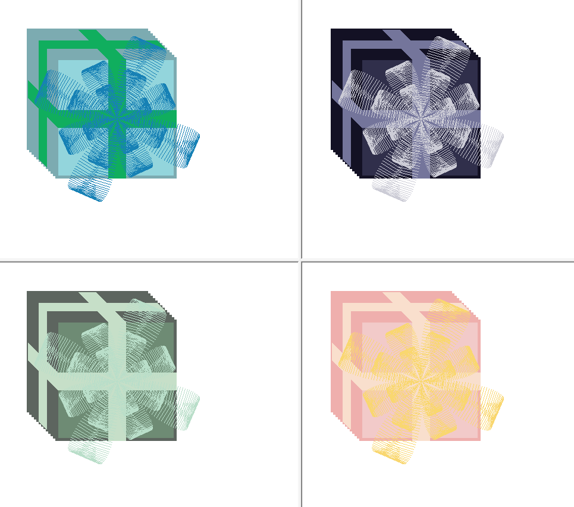
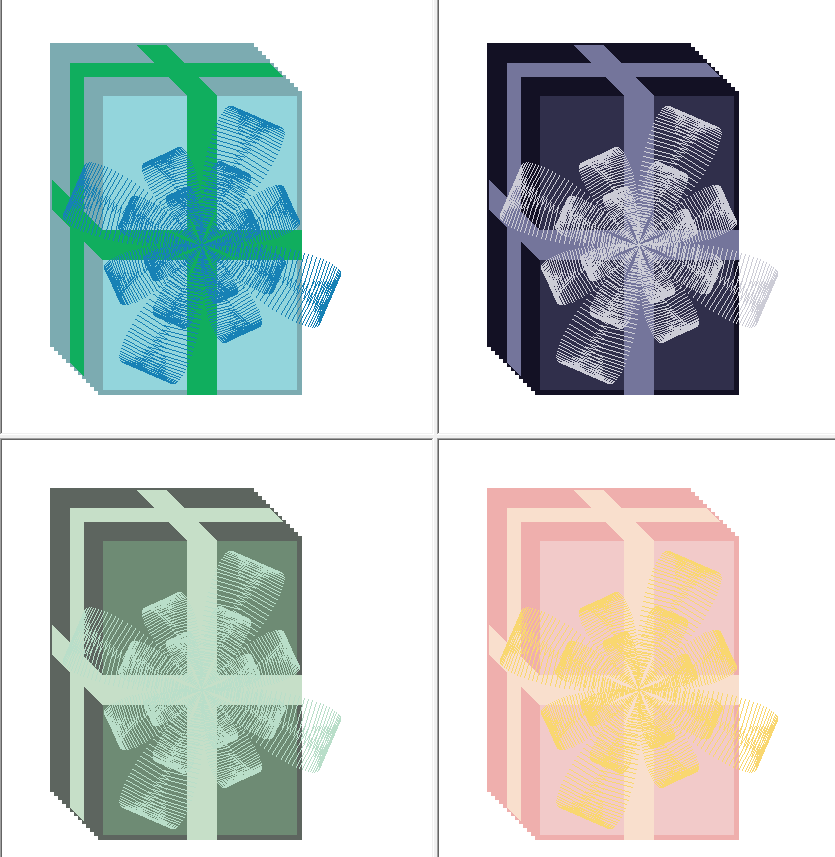

## 1 题目分析

题目要求编写MFC程序，在图形界面上绘制一个漂亮的图案。

需要至少3种自定义的图形类及至少3种不同颜色。

## 2 实现思路

通过定义类 `CPoint2D` 、`CParallelogram` 、`CCuboid` 、`CBow` 实现自定义图形类的位置与形状的确定。



在 `CDrawPattern.h`、 `CDrawPattern.cpp` 中，以全局函数的形式实现各部分的绘制及组合图形（礼物）的绘制。

## 3 模块功能

### 3.1 CPoint2D

该类为自定义点类，成员变量包含点的x坐标与y坐标。

### 3.2 CCuboid

该类为自定义长方体类，成员变量：
```cpp
CPoint2D m_point1, m_point2;
double m_thickness;
```
其中 `m_point1` 为长方体底面的左上角，`m_point2` 为长方体底面的右下角，`m_thickness` 为长方体的厚度。

配合函数 `gb_drawCuboid` 可完成长方体的绘制
```cpp
void gb_drawCuboid(CDC& d, const CCuboid& p, int penStyle,
    COLORREF rgb1, COLORREF rgb2)
```
函数参数中 $\text{rgb1}$ 为长方体侧面颜色， $\text{rgb2}$ 为长方体上面颜色。

该函数通过平移矩形的绘制达成长方体的绘制。

具体效果如下：


通过改变参数，可以实现任意位置、任意长宽高与任意颜色的长方体的绘制。

### 3.3 CParallelogram

该类为自定义平行四边形类。成员变量：
```cpp
CPoint2D m_point1, m_point2, m_point3;
```
其中 `m_point1` 为平行四边形的左上角，`m_point2` 为平行四边形的左下角，`m_point3` 为平行四边形的右上角。

配合函数 `gb_drawParallelogram` 可完成平行四边形的绘制。通过平行地画线，实现任意位置、任意边长、任意颜色的平行四边形绘制。




### 3.4 CBow

该类为自定义蝴蝶结类。成员变量：
```cpp
CPoint2D m_centerPoint;
double m_r;
```
其中 `m_centerPoint` 为中心点， `m_r`表示半径大小。

配合函数 `gb_drawBow` 可完成平行四边形的绘制。通过三角函数的搭配，实现任意位置、任意大小、任意颜色的蝴蝶结绘制。




### 3.5 图形的组合Gift

通过上述自定义图形与绘制函数的组合搭配，绘制出了能调整大小比例、改变色系的礼物图案。

具体色系由 `m_flag` 控制，可在文档拆分时现实不同色系。分为蓝色系、紫色系、绿色系与粉色系。每个礼物的侧面、顶面、丝带与蝴蝶结的颜色各不相同。颜色采用传统中国色，见 `6 使用颜色`。

详情见 `5 测试报告`。

## 4 代码运行方法

 平台：Visual Studio 2022

 x64 release

## 5 测试报告




## 6 使用颜色

| 名称                              | RGB            |
| -------------------------------- | -------------- |
| <font color=#7cabb1>闪蓝</font>   | R124 G171 B177 |
| <font color=#93d5dc>清水蓝</font> | R147 G213 B220 |
| <font color=#10aec2>甸子蓝</font> | R016 G174 B094 |
| <font color=#1781b5>釉蓝</font>   | R023 G129 B181 |
| <font color=#131124>暗蓝紫</font> | R019 G017 B036 |
| <font color=#302f4b>野葡萄</font> | R048 G047 B075 |
| <font color=#74759b>螺甸紫</font> | R116 G117 B155 |
| <font color=#ccccd6>远山紫</font> | R204 G204 B214 |
| <font color=#5d655f>狼烟灰</font> | R093 G101 B095 |
| <font color=#6e8b74>瓦松绿</font> | R110 G139 B116 |
| <font color=#c6dfc8>淡翠绿</font> | R198 G223 B200 |
| <font color=#b9dec9>竹篁绿</font> | R185 G222 B201 |
| <font color=#efafad>无花果</font> | R239 G175 B173 |
| <font color=#f2cac9>淡绯</font>   | R242 G202 B201 |
| <font color=#f9e9cd>米色</font>   | R249 G223 B205 |
| <font color=#f9d770>淡茧黄</font> | R249 G215 B112 |

## 7 提高部分

说明各种图形的可能潜在实际应用

* 长方体类与其绘制函数可以应用在2D的立体图形表示
* 平行四边形类与其绘制函数扩充了基本图形的绘制，使得几何形状的绘制更加方便

## 8 参考资料

1. https://blog.csdn.net/Eastmount/article/details/53180524
2. https://www.zhongguose.com/
