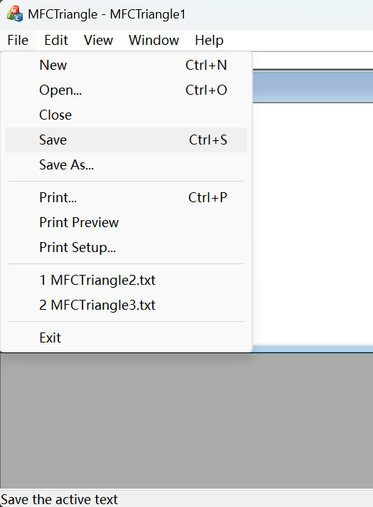
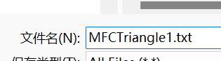
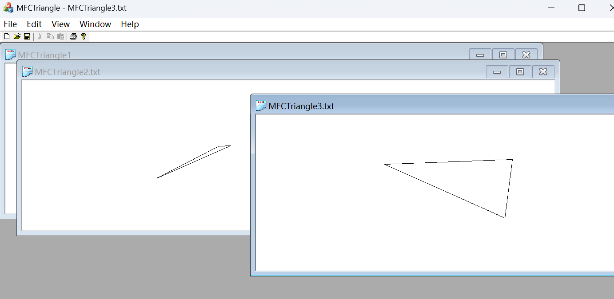
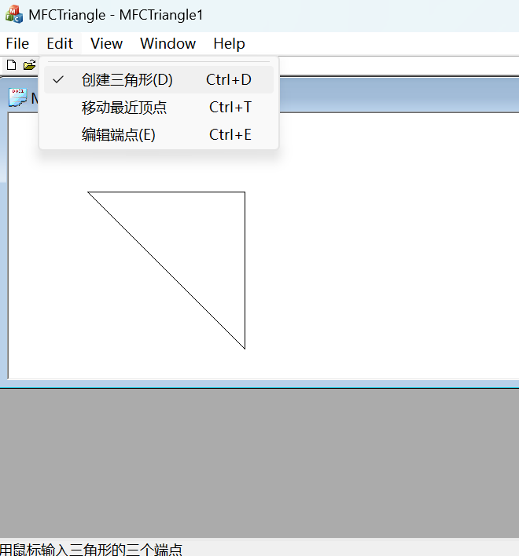
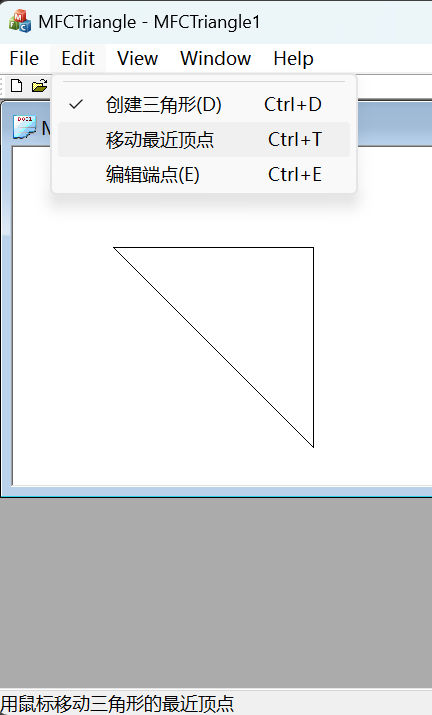
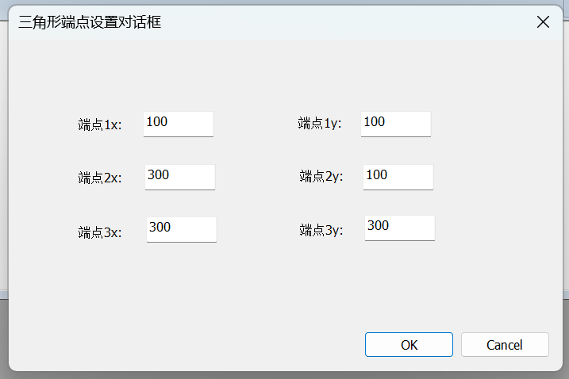
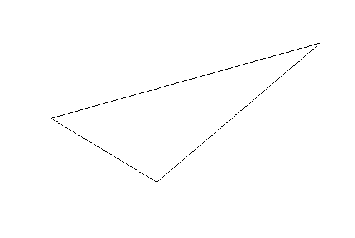

## 1 题目分析

题目要求编写多文档MFC程序，实现单个三角形的生成与编辑。
1. 通过自描述文件机制，打开和保存存放单个三角形的三个顶点坐标值的文本文件。
2. 通过鼠标创建三角形并移动三角形的顶点。
3. 通过对话框直接编辑三角形的顶点坐标值。

## 2 实现思路

1. 设计 `CTriangleSegment` 类，存放三角形的三个顶点。

2. 在 `MFCTriangleDoc.h` 与 `MFCTriangleDoc.cpp` 中，添加自描述文件的格式与内容规范，实现三角形三个顶点坐标的存储与读取。

3. 在 `CMFCTriangleView` 用 `m_flag` 控制状态，其中 10 11 12为鼠标点击输入1 2 3顶点，20 21为鼠标移动最近顶点。

   共处理以下事件
   ```cpp
   afx_msg void OnEditDialog();
	afx_msg void OnEditCreate();
	afx_msg void OnUpdateEditCreate(CCmdUI* pCmdUI);
	afx_msg void OnEditMove();
	afx_msg void OnUpdateEditMove(CCmdUI* pCmdUI);

	afx_msg void OnLButtonDown(UINT nFlags, CPoint point);
	afx_msg void OnLButtonUp(UINT nFlags, CPoint point);
	afx_msg void OnMouseMove(UINT nFlags, CPoint point);
   ```

   程序中设计用鼠标移动三角形的顶点为移动离鼠标距离最近的顶点。通过鼠标位置与三个顶点的欧几里得距离判断远近。

4. 基于对话框，实现了编辑三角形顶点坐标值。

## 3 代码运行方法

 平台：Visual Studio 2022

 x64 release

## 4 程序功能说明

### 4.1 自描述文档
点击File-save，将文件名**添加后缀 .txt**，即可保存


点击File-open，打开保存的自描述文档


### 4.2 创建三角形
选择创建三角形后，从鼠标点击依次设置三角形的三个顶点。点击超过3次则重新设置 k%3 的顶点。


### 4.3 移动最近顶点
选择“移动最近顶点”，可以通过鼠标修改三个端点的位置。程序设计中判断顶点中离鼠标位置最近的顶点进行位置修改。该顶点跟随鼠标的移动而移动。


### 4.4 编辑端点
选择“编辑端点”，弹出对话框，设置三个端点的坐标


## 5 测试报告
运行结果如图所示


## 6 提高部分

橡皮筋绘制技术

指在图形界面绘制时，图像能够实时变化。线条像橡皮筋一样，长短和端点都随鼠标变化。使用户进行可视化编辑。

程序中通过鼠标移动的事件 `OnMouseMove` 实时更新端点坐标，从而实现橡皮筋绘制技术。
